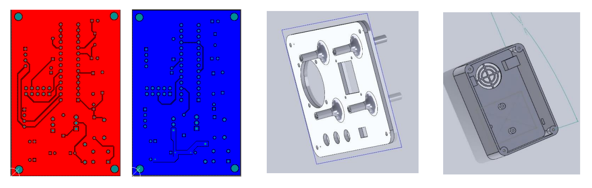
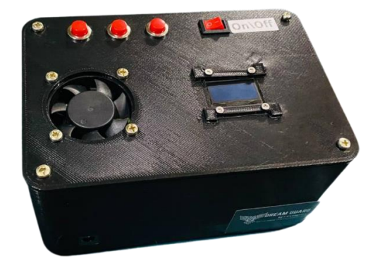

# DreamGuard - Biomedical Sleep Inducer
Dream Guard is an innovative biomedical device designed to improve sleep quality by utilizing non-invasive techniques to alter brain activity and promote sleep. The primary goal of Dream Guard is to provide a portable, cost-effective solution for individuals suffering from insomnia.
<!DOCTYPE html>
<html lang="en">
<head>
    <meta charset="UTF-8">
    <meta name="viewport" content="width=device-width, initial-scale=1.0">
    
</head>
<body>

<h1>Dream Guard Project</h1>

<h2>Project Description</h2>

    Dream Guard is a biomedical sleep inducer designed to improve the quality of sleep for individuals suffering from insomnia. The device uses non-invasive magnetic field technology to promote sleep, offering a safer alternative to medication. The project is developed by a team of four engineering undergraduates from the University of Moratuwa, who have combined their expertise to create a portable, efficient, and user-friendly solution to address sleep disorders.

<h2>Objective</h2>

    The primary objective of the Dream Guard project is to provide an effective and long-term solution for individuals suffering from insomnia. By leveraging magnetic field technology, the device aims to enhance sleep quality without the side effects associated with conventional treatments like medication. The project also focuses on creating a cost-effective and portable device that can be easily used by anyone, anywhere.

<h2>Power & Efficiency</h2>

    Dream Guard is powered by three 3.7V rechargeable batteries, managed by a Battery Management System (BMS) to ensure portability and protection from overcharging. The device includes an LM7805 voltage regulator to maintain a stable 5V output for its components. Efficient power management allows the device to be used reliably over extended periods without frequent recharging.

<h2>Key Features</h2>
<ul>
    <li><strong>Non-Invasive Sleep Induction:</strong> Uses a magnetic field generator to promote sleep without medication.</li>
    <li><strong>User-Friendly Interface:</strong> Equipped with an OLED display and buttons for easy time setting and operation.</li>
    <li><strong>Portable Design:</strong> Compact and lightweight, powered by rechargeable batteries for on-the-go use.</li>
    <li><strong>Automatic Shutoff:</strong> Includes a timer feature to automatically turn off the device after the user-defined duration.</li>
    <li><strong>Cooling System:</strong> Integrated fan to prevent overheating of the magnetic field generator.</li>
</ul>

<h2>Hardware Specifications</h2>
<ul>
    <li><strong>Power Source:</strong> Three 3.7V Li-ion rechargeable batteries</li>
    <li><strong>Voltage Regulation:</strong> LM7805 voltage regulator for stable 5V output</li>
    <li><strong>Microcontroller:</strong> ATMega328P for controlling device functions</li>
    <li><strong>Magnetic Field Generator:</strong> Generates a 9.6Hz electromagnetic field</li>
    <li><strong>Display:</strong> 128×64 OLED screen for user interaction</li>
    <li><strong>Cooling:</strong> Built-in fan to manage device temperature</li>
    <li><strong>Additional Components:</strong> Real Time Clock (RTC), BMS PCM Battery Protection Board</li>
</ul>

## PCB and Enclosure

## Final Product

## Contributors
- [Jayamadu Gammune](https://github.com/JayxTG)
- [Rebecca Fernando](https://github.com/rnsfernando)
- [Tashin Kavishan](https://github.com/kavishanGT)
- [Charles John Peter](https://github.com/Charlie174)

</body>
</html>
